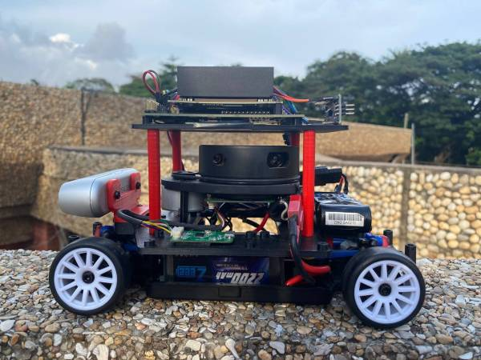
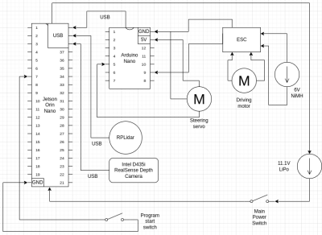

# [Autonomous Ground Vehicle for Simultaneous Localization and Mapping (SLAM) with LiDAR and Intel D435i](https://github.com/adoodevv/pathfinders)

## Concept Note

**Relevance of Autonomous Ground Vehicles for Simultaneous Localization and Mapping (SLAM) Using RPLIDAR and Camera**

Autonomous ground vehicles (AGVs) equipped with SLAM technology have become vital in modern applications such as ground observatories, autonomous transportation, and precision agriculture. 

The integration of RPLIDAR (a rotational laser scanner) and cameras enhances their ability to perceive, map, and navigate complex environments effectively. Below are the key aspects highlighting their relevance: 

1. Enhanced Perception in Dynamic Environments

    RPLIDAR: Provides precise distance measurements in a 360-degree field of view, enabling AGVs to detect obstacles, understand terrain, and create detailed environmental maps.
    Cameras: Capture visual information for object recognition, semantic segmentation, and texture mapping, complementing the LIDAR data for richer scene understanding.

2. Simultaneous Localization and Mapping (SLAM)

    SLAM enables AGVs to build a map of an unknown environment while simultaneously determining their location within it.
    The fusion of RPLIDAR and camera data improves SLAM accuracy:
        RPLIDAR: Offers robust spatial mapping in low-light or featureless conditions.
        Camera: Provides visual cues, aiding in feature extraction and alignment where LIDAR might struggle (e.g., smooth surfaces).

3. Applications in Ground Observatories

    Environmental Monitoring: AGVs equipped with SLAM can autonomously navigate rough terrains, collecting geospatial and ecological data. Precision Mapping: Facilitates detailed mapping for ground observatories in agriculture, geology, and conservation, helping scientists study terrain and habitats more efficiently.

4. Applications in Autonomous Vehicles

    Navigation and Path Planning: Combines the strengths of LIDAR and cameras to avoid obstacles, follow paths, and adapt to dynamic environments.
    Urban and Off-Road Scenarios: Enables safe operation in diverse conditions, from city streets to rugged outdoor terrains.

5. Advantages of Multisensor Integration

    Redundancy and Complementarity: The combination of RPLIDAR and cameras provides robustness against sensor failures or limitations. Cost-Effective Deployment: RPLIDAR systems are relatively affordable compared to higher-end LIDAR systems, making them suitable for wide adoption in research and industry.

6. Future Prospects

    As SLAM algorithms advance, AGVs equipped with RPLIDAR and cameras will play a pivotal role in automating ground observatories and transportation systems, enhancing efficiency, safety, and scalability.

## Mobility 

###  Vehicle Chassis

The project is based on the LaTrax 1/18 Rally chassis (Model #75054-5), which provides a solid foundation for the autonomous vehicle. Key specifications include:

- Length: 265 mm (10.4 inches)
- Width (Track): 125 mm (4.92 inches) both front and rear
-  Height: 90 mm (3.5 inches)
-  Wheelbase: 165 mm (6.5 inches)
-  Weight: 554 g (19.5 ounces) with battery, 430 g (15.2 ounces) without battery
- Chassis Material: Molded composite Nylon monocoque

This chassis was chosen for its compact size, lightweight design, and durability.

### Motor Selection and Implementation

The LaTrax chassis comes with a 370 brushed motor. For autonomous operation, this motor is retained and controlled using the following components:

- ESC: Comes with Latrax chassis The model’s ESC is an extemely powerful electronic device capable of delivering high current.

###  Steering System

The original steering system uses a bellcrank mechanism. For autonomous control, this has been modified to use a servo motor, controlled by:

-  Arduino Nano: This allows for accurate steering control managed by the Jetson Orin Nano.

###  Drive System

- Type: Shaft-driven 4WD
   -  Transmission: 14T pinion / 54T spur
   - Gear Ratio: 2.5:1 (internal), 9.64:1 (overall, stock)
  -  Differential: Gear type
   - Gear Pitch: 0.5 Mod

This 4WD system provides excellent traction and stability, which is crucial for autonomous operation in various terrains.

## Component Mounting

A custom base plate has been designed and fabricated to mount all the additional components required for autonomous operation. This includes:

   - RPLidar
   - Intel D435i RealSense Depth Camera
   - Nvidia Jetson Orin Nano
   - L298N motor driver
   - ESC 2 Halo ring switches

The base plate serves as a central mounting point, ensuring all components are securely attached and properly positioned. Additional custom mounts have been created for:

  -  Camera mount: Attaches the Intel D435i camera to the base plate.
  -  Base mount: Connects the entire setup (base plate with all components) to the LaTrax chassis.

These custom mounts ensure proper alignment and stability of all components during operation.

## Engineering Principles

### Speed

The stock motor and gearing provide a balance between speed and torque. The overall drive ratio of 9.64:1 allows for good low-speed control, which is essential for precise autonomous movement.

### Torque

The gearing system provides ample torque for the vehicle's size and weight. This ensures good acceleration and climbing ability, which are important for navigating various terrains autonomously.

### Power

The 370 brushed motor, combined with the stock 6V from the NiMH battery, provides sufficient power for the vehicle's operations. The power delivery is managed by the ESC, allowing for fine control of the vehicle's movements.

## Power and Sense Management

1. Jetson Orin Nano (Primary Controller)

    Purpose: Acts as the brain of the system, handling high-level decision-making, sensor data processing, and sending commands to motor controllers. Connections:

    RPLidar (Serial Over USB): Collects 360-degree LiDAR data, which is used for mapping, obstacle detection, or navigation.
    Intel D435i Camera (Serial Over USB): Provides depth sensing and visual information, useful for object detection, path planning, and visual SLAM.
    Arduino Nano (Serial Over USB): Communicates with the Arduino, which manages motor control.

    Power Consumption: The Jetson Orin Nano consumes around 5-15W depending on processing load.

2. Arduino Nano (Motor Controller)

    Purpose: Receives control commands from the Jetson Orin Nano and translates them into signals for the motor drivers to control the wheels and steering. Connections:

    Communicates with the motor driver via PWM signals, allowing precise control over speed and direction.

    Power Consumption: Typically consumes 0.25W.

3. RPLidar

    Purpose: Provides distance measurements and 2D mapping around the robot for obstacle avoidance.

    Power Consumption: Around 3-5W.

4. Intel D435i Depth Camera

    Purpose: Offers depth perception to the robot, crucial for tasks like object recognition, depth mapping, and navigation.

    Power Consumption: Around 1.5W.

5. Electronic Speed Controller

    Purpose: Drives the DC motor responsible for the vehicle's motion. The motor driver allows control of both speed and direction of the motor via PWM inputs. Connections:

    Receives PWM signals from the Arduino Nano to control the speed and direction of the 6V brushed motor.

    Power Consumption: Minimal, but drives the 6V motor which may consume between 2-4W depending on load.

6. 6V DC Brushed Motor

    Purpose: Powers the wheels, providing the propulsion needed to move the vehicle.
    Power Consumption: Between 2-4W depending on speed and load.

7. Servo Motor

    Purpose: Provides steering control for the vehicle (likely Ackermann steering), adjusting the angle of the front wheels.
    Power Consumption: Around 0.5-1.5W, varying based on the load and steering angle.

8. Batteries

    Purpose: The main power source for the system, 11.1V LiPo, supplies voltage to the Jetson whereas the the 6V NiMH powers the driving motor.
    Power Output: 11.1V with a capacity of 2200mAh, providing enough energy to sustain the robot's operations for a moderate duration.

9. Switches

    Unordered List ItemPower Switch: Controls the overall power to the system, turning the vehicle on or off.
    Program Start Switch: Allows the user to initiate the program on the Jetson Orin Nano, triggering autonomous behavior.

### Summary of Power Consumption

   - Jetson Orin Nano: 5-15W
   - RPLidar: 3-5W
   - Intel D435i Camera: 1.5W
   - Arduino Nano: 0.25W
   - 6V Brushed Motor: 2-4W
   - Servo Motor: 0.5-1.5W

### Reasons for Selecting Sensors

RPLidar: Provides precise distance measurements and 360-degree scans, making it ideal for SLAM (Simultaneous Localization and Mapping) or obstacle avoidance in dynamic environments.

Intel D435i Depth Camera: Adds 3D vision, essential for depth-based navigation and recognizing objects.

## Research Team

